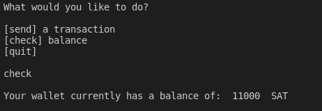
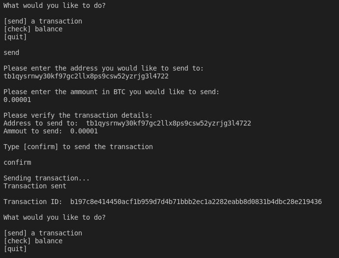

# Project 1
For this project I decided I would build a small command line tool in Python that allows me to send a transaction. The tool uses the pythonbitcoinlib that we installed in class. The project is also currently configured to run on the BC testnet. The CLI currently only has 2 commands that it can run. You can check the ballance of the currently connected wallet, or you can send a transaction.

## Checking your balance
You can type "check" into the CLI to check your current wallet balance. This is shown in the below screenshot.

## Sending a Transaction
You can type "send" to start the process of sending a transaction using my CLI. You must first enter the address you would like to send to. Then you can type the amount you would like to send. Finally, my CLI will ask you to confirm the details of the transaction before sending it. If you type anything other that "confirm" the transaction will not be send and the user will be returned to the main menu. You can see how sending a transaction using my tool looks in the below screenshot.

Note: You can also type "quit" to cleanly exit the CLI.
