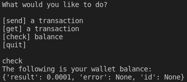

# Project 2
This project works very in a similar manner to project 1. It is a command line interface where you can type commands to check your balance, send a transaction, or get a transaction by ID. However, unlike project 1 the implementation of these methods does not depend on the BitcoinPythonLib. Instead this project uses raw RPC calls to the bitcoind service. In this project I also take advantage of the dotenv lib to simply load the password for the RPC user.

## Checking your balance
Like in the first version of this project you can check your balance by typing "check" like in the screenshot below.

## Sending a Transaction
Also similar to project 1, you can send a transaction by typing "send" like in the screenshot below.

## Getting a Transaction
In addition to the two methods above, in this project you can type "get" to get a transaction by ID. You can see how this works in the screenshot below. After retrieving the transaction, the CLI simply prints the raw JSON response that is received.

Note: You can also type "quit" to cleanly exit the CLI.

Note: If you type a command other than those listed above, the CLI will simply ask you to try again.